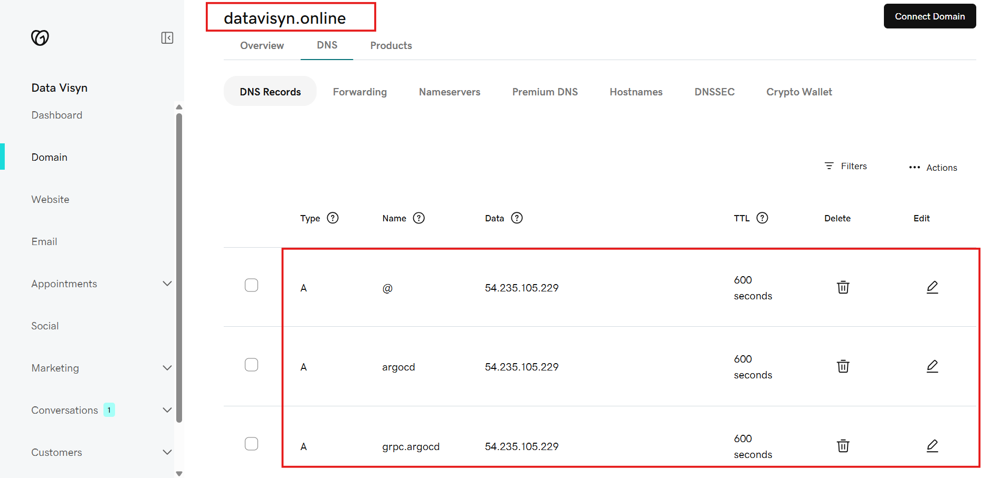

# datavisyn-challenge

Datavisyn DevOps Challenge

---

## Architecture Overview

The platform is deployed on AWS using an EKS (Elastic Kubernetes Service) cluster. The architecture leverages several key components for security, automation, and scalability. Below is a high-level overview:


### Key Components

- **AWS EKS Cluster**: Hosts all Kubernetes workloads.  
  [AWS EKS Documentation](https://docs.aws.amazon.com/eks/)
- **Load Balancer**: Exposes services to the internet and forwards traffic to the Ingress Controller.  
  [AWS Load Balancer](https://docs.aws.amazon.com/elasticloadbalancing/)
- **Ingress Controller (Nginx)**: Handles routing, TLS termination, and forwards requests to internal services.  
  [NGINX Ingress Controller](https://kubernetes.github.io/ingress-nginx/)
- **OAuth2 Proxy**: Secures access to the frontend by authenticating users via GitHub OAuth.  
  [OAuth2 Proxy](https://oauth2-proxy.github.io/oauth2-proxy/)
- **Frontend React App**: User-facing application, served via Nginx.
- **Backend FastAPI**: Provides API endpoints for the frontend.  
  [FastAPI](https://fastapi.tiangolo.com/)
- **ArgoCD**: GitOps tool for continuous deployment of Kubernetes manifests.  
  [ArgoCD](https://argo-cd.readthedocs.io/)
- **Cert Manager Operator**: Manages TLS certificates for secure communication.  
  [Cert Manager](https://cert-manager.io/)
- **Sealed Secrets Controller**: Manages encrypted secrets in the cluster.  
  [Sealed Secrets](https://github.com/bitnami-labs/sealed-secrets)
- **GoDaddy**: DNS provider for public domains.  
  [GoDaddy](https://www.godaddy.com/)

---

## Project Structure

```
applications/            # Application source code (backend & frontend)
  backend/               # FastAPI backend service
  frontend/              # React frontend app (served by Nginx)

argocd/
  apps/                  # ArgoCD Application manifests

helm/                    # Helm charts for deploying components

terraform/               # Infrastructure as Code for AWS/EKS
  modules/               # Reusable Terraform modules
    k8s/                 # Kubernetes-related Terraform modules
    network/             # (Example) Networking modules (VPC, subnets, etc.)
    eks/                 # (Example) EKS cluster provisioning modules

```

## Component Details

### 1. **Frontend React App**
- Built with React.
- Served via Nginx in a container.
- Handles user authentication via OAuth2 Proxy.
- Communicates with the backend via `/api/` endpoints.

**Screenshots:**


### 2. **Backend FastAPI**
- Python FastAPI application.
- Provides REST API endpoints.
- Exposed internally to the frontend via the Ingress Controller.

### 3. **OAuth2 Proxy**
- Protects the frontend.
- Integrates with GitHub OAuth for authentication.
- Only authenticated users can access the frontend.

### 4. **Ingress Controller (Nginx)**
- Handles incoming HTTP/HTTPS traffic.
- Performs TLS termination using certificates managed by Cert Manager.
- Routes traffic to the appropriate backend services.

### 5. **ArgoCD**
- Manages application deployments using GitOps.
- Monitors GitHub repositories for changes and syncs them to the cluster.

**Screenshots:**


### 6. **Cert Manager Operator**
- Issues and renews TLS certificates for the Ingress Controller.
- Integrates with GoDaddy DNS for domain validation.

### 7. **Sealed Secrets Controller**
- Allows storing encrypted secrets in Git, which are decrypted only inside the cluster.

---

## Flow

1. **User Access**
   - Users access the platform via the public domain (e.g., `https://datavisyn.online`).
   - The Load Balancer forwards traffic to the Nginx Ingress Controller.

2. **Authentication**
   - The OAuth2 Proxy intercepts requests and redirects unauthenticated users to GitHub OAuth.
   - Upon successful authentication, users are redirected back to the frontend.

3. **Frontend-Backend Communication**
   - The React frontend communicates with the FastAPI backend via `/api/` endpoints.
   - The Ingress Controller proxies these requests to the backend service.

4. **TLS Termination**
   - TLS certificates are managed by Cert Manager and provisioned via GoDaddy DNS.

5. **Continuous Deployment**
   - ArgoCD watches the GitHub repository for changes.
   - On updates, ArgoCD syncs Kubernetes manifests and Helm charts to the cluster.

---

## Setup Instructions

### Prerequisites

- AWS account with EKS and IAM permissions
- GoDaddy account for DNS management
- GitHub account for OAuth and repository access
- `kubectl`, `helm`, `terraform`, and `kubeseal` CLI installed locally

### 1. **Clone the Repository**

```sh
git clone https://github.com/minasaeedbasta/datavisyn-challenge.git
cd datavisyn-challenge
```

### 2. **Provision Infrastructure with Terraform**

Navigate to the terraform directory and update `terraform.tfvars` with your AWS and DNS details.

```sh
cd terraform
terraform init
```

Apply the Terraform modules in order, targeting each major component:

```sh
terraform apply --target="module.vpc"
```
*Creates the VPC, subnets, and networking resources.*

```sh
terraform apply --target="module.eks"
```
*Creates the EKS cluster and related IAM roles.*

```sh
terraform apply --target="module.helm"
```
*Installs Helm and any Helm-managed components (e.g., ingress controller, cert-manager).*

```sh
terraform apply --target="module.k8s"
```
*Applies Kubernetes manifests and ArgoCD bootstrap resources.*

This will deploy:
- Frontend React App
- Backend FastAPI
- OAuth2 Proxy
- Cert Manager
- Sealed Secrets

---

### 3. **Set GoDaddy A Records**

After the NLB (Network Load Balancer) is created, get its DNS name:

```sh
# Get the NLB DNS name (replace with your actual service/namespace)
kubectl get svc -n ingress-nginx
```

Use `dig` or an online DNS lookup tool to resolve the NLB DNS name to its public IP:

```sh
dig <NLB_DNS_NAME>
```

Go to your GoDaddy DNS management panel and set A records for:
- `datavisyn.online` → [NLB Public IP]
- `argocd.datavisyn.online` → [NLB Public IP]



Wait for DNS propagation.

---

### 4. **Create and Seal Secrets for OAuth2 Proxy**

Generate a Kubernetes secret manifest for OAuth2 Proxy (replace placeholders with your actual values):

```sh
kubectl -n oauth2-proxy create secret generic oauth2-secret \
  --from-literal=client-id=GITHUB_CLIENT_ID \
  --from-literal=client-secret=GITHUB_CLIENT_SECRET \
  --from-literal=cookie-secret=$(openssl rand -base64 32 | tr -dc 'a-zA-Z0-9' | fold -w32 | head -n1) \
  --dry-run=client -o yaml > oauth2-secret.yaml
```

Seal the secret using `kubeseal`:

```sh
kubeseal --controller-namespace kube-system --controller-name sealed-secrets \
  --format yaml < oauth2-secret.yaml > oauth2-sealed-secret.yaml
```

- Replace `GITHUB_CLIENT_ID` and `GITHUB_CLIENT_SECRET` with your actual GitHub OAuth app credentials.
- The sealed secret (`oauth2-sealed-secret.yaml`) can now be safely committed to your repository.

---

### 5. **Access ArgoCD Dashboard**

Expose ArgoCD server (port-forward or via Ingress):

```sh
kubectl port-forward svc/argocd-server -n argocd 8080:443
```

Or access via Ingress at: [https://argocd.datavisyn.online](https://argocd.datavisyn.online)

---

## Access Links & Domains

| Service      | URL / Domain                        | Notes                   |
|--------------|-------------------------------------|-------------------------|
| Frontend     | https://datavisyn.online            | Main user interface     |
| ArgoCD       | https://argocd.datavisyn.online     | ArgoCD dashboard        |
| Backend API  | https://datavisyn.online/api/hello  | Example backend endpoint|

- **GitHub OAuth App**: Used for authentication via OAuth2 Proxy.
- **GoDaddy**: Manages DNS for `datavisyn.online` and `argocd.datavisyn.online`.

---

## Notes

- All secrets should be managed using Sealed Secrets and not committed in plain text.
- TLS certificates are automatically managed by Cert Manager.
- For troubleshooting, check ArgoCD and Kubernetes logs.


## References

### Documentation & Official Resources

- [AWS EKS Documentation](https://docs.aws.amazon.com/eks/)
- [AWS Load Balancer](https://docs.aws.amazon.com/elasticloadbalancing/)
- [NGINX Ingress Controller](https://kubernetes.github.io/ingress-nginx/)
- [OAuth2 Proxy](https://oauth2-proxy.github.io/oauth2-proxy/)
- [FastAPI](https://fastapi.tiangolo.com/)
- [ArgoCD](https://argo-cd.readthedocs.io/)
- [Cert Manager](https://cert-manager.io/)
- [Sealed Secrets](https://github.com/bitnami-labs/sealed-secrets)
- [GoDaddy](https://www.godaddy.com/)

### Terraform Modules Used

- [terraform-aws-modules/vpc/aws](https://github.com/terraform-aws-modules/terraform-aws-vpc)
- [terraform-aws-modules/eks/aws](https://github.com/terraform-aws-modules/terraform-aws-eks)
- [terraform-helm-provider](https://registry.terraform.io/providers/hashicorp/helm/latest/docs)
- [terraform-kubernetes-provider](https://registry.terraform.io/providers/hashicorp/kubernetes/latest/docs)

### Helm Charts Used

- [nginx-ingress](https://artifacthub.io/packages/helm/ingress-nginx/ingress-nginx)
- [oauth2-proxy](https://artifacthub.io/packages/helm/oauth2-proxy/oauth2-proxy)
- [cert-manager](https://artifacthub.io/packages/helm/cert-manager/cert-manager)
- [argo-cd](https://artifacthub.io/packages/helm/argo/argo-cd)
- [sealed-secrets](https://artifacthub.io/packages/helm/bitnami/sealed-secrets)

### Other References

- [ArgoCD Dex GitHub Connector](https://argo-cd.readthedocs.io/en/stable/operator-manual/user-management/keycloak/#github)
- [NGINX Ingress OAuth2 Protection Example](https://kubernetes.github.io/ingress-nginx/examples/auth/oauth-external-auth/)